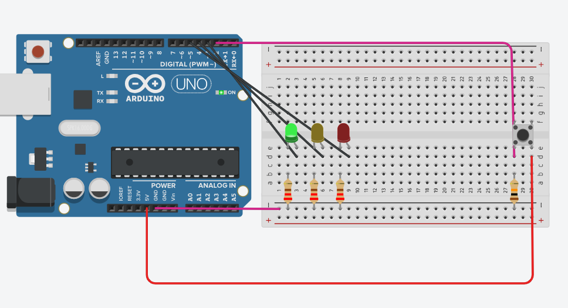
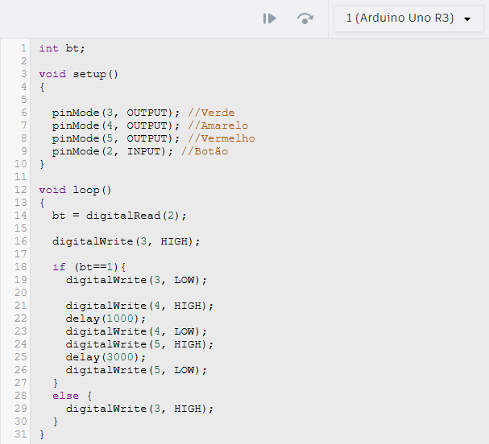

Nome: João Gabriel Freire de Andrade 2ºS Informática

## Componentes Utilizados
+ 1 Arduino Uno
+ 3 LEDs (vermelho, amarelo e verde)
+ 3 resistores de 220Ω
+ 1 botão
+ 1 resistor de 10kΩ 
+ Fios jumper
+ 1 protoboard
 

## Configuração do Circuito
  Primeirante liguei a porta GND na parte negativa da protoboard para a ativação dos componentes com os resistores, que são necessários para ligar tanto os leds quanto o botão, e então liguei a porta 5V ao botão para alimentá-lo
  
 
## Programação

Primeiro Defini a variável "bt" para receber a variação de estado do botão, então no setup define as saídas para os leds e a entrada para o botão. 
Na configuração de ordem dos leds, comecei ativando o led verde com um digitalWrite com o valor "HIGH" para que o led fique acesso, então adicionei uma condicional que le o estado do botão, que esta sendo verificado no digitalRead, para fazer a ação requisitada, desligando o led verde e ligando e logo depois desligando, o led amarelo e vermelho com seus devidos delays após a ativação do botão, e um else para garantir que o led verde fique ligado enquanto o botão estiver desativado.

  
